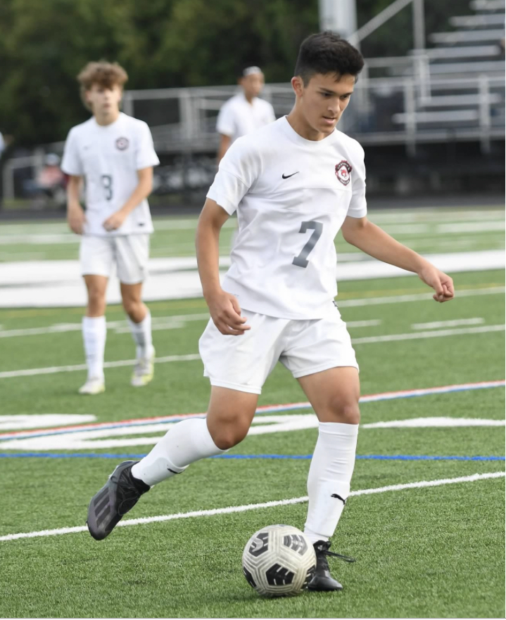
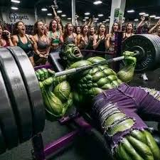

# 👨‍🎓 Student Portfolio - Christian Campos

---

## 📋 Student Information

| **Field** | **Details** |
|-----------|-------------|
| **Nickname/Pseudonym** | Christian |
| **Interesting Fact** | My favorite sport is soccer. |
| **Interesting Fact2** | I can bench press 315 lbs. |

---

## ⚽ Soccer Interest

Soccer has been a central passion in my life for as long as I can remember. From playing in local youth leagues to competing at higher levels, the beautiful game has taught me valuable lessons about teamwork, perseverance, and strategic thinking. I particularly enjoy the tactical aspects of the sport, analyzing formations and player movements, which has helped develop my analytical mindset. Whether I'm playing on the field, watching professional matches, or discussing tactics with friends, soccer continues to be both a source of joy and a way to stay physically active and mentally sharp.

## 🖼️ Portfolio Images

### Soccer

### Bench Press

